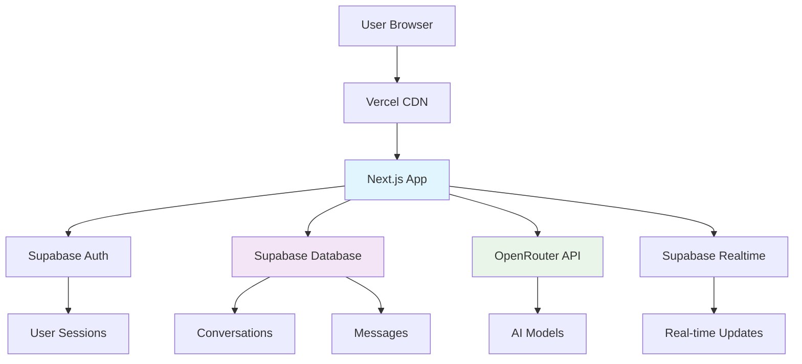
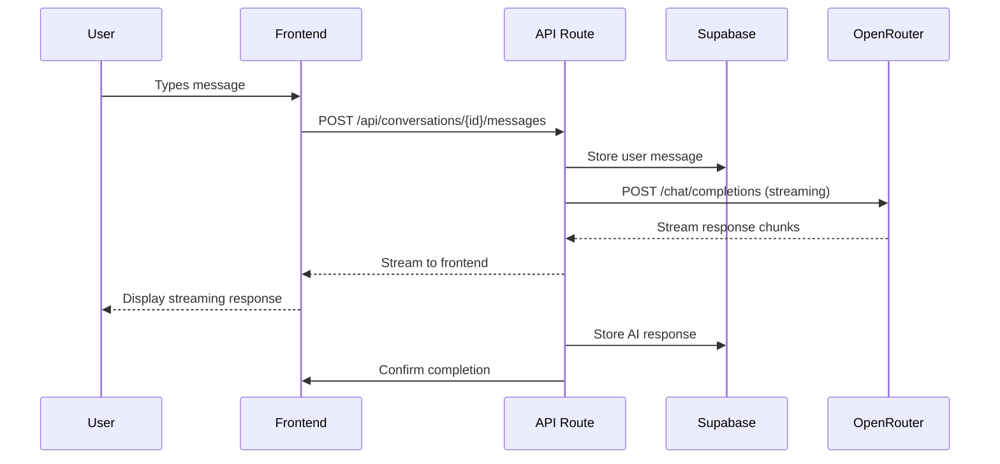
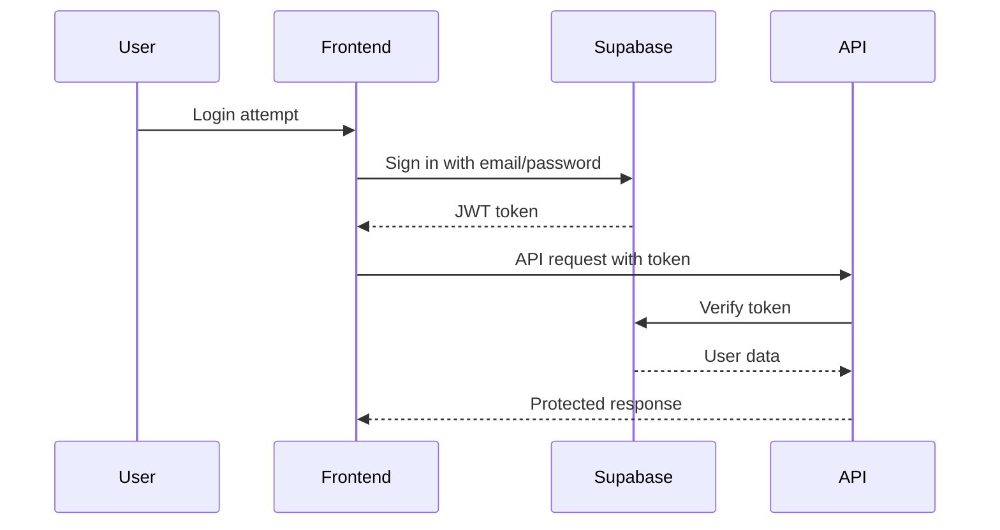
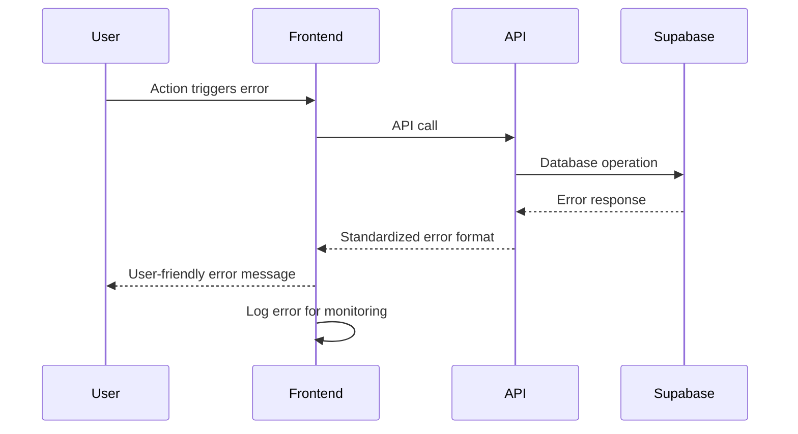

# Sleek Modern Chat Interface Fullstack Architecture Document

## Introduction

This document outlines the complete fullstack architecture for Sleek Modern Chat Interface, including backend systems, frontend implementation, and their integration. It serves as the single source of truth for AI-driven development, ensuring consistency across the entire technology stack.

This unified approach combines what would traditionally be separate backend and frontend architecture documents, streamlining the development process for modern fullstack applications where these concerns are increasingly intertwined.

## ✅ Implementation Status: FULLY IMPLEMENTED

### Completed Components
- ✅ **Frontend**: Next.js 14 with TypeScript and Tailwind CSS
- ✅ **Backend**: Supabase with PostgreSQL and real-time subscriptions
- ✅ **Authentication**: Supabase Auth with custom user management
- ✅ **Database**: Complete schema with RLS policies
- ✅ **API Integration**: OpenRouter with streaming support
- ✅ **UI Components**: Complete chat interface with responsive design
- ✅ **Real-time**: Live message synchronization
- ✅ **State Management**: React Context and custom hooks
- ✅ **Error Handling**: Comprehensive error boundaries and user feedback

### Current Architecture Overview
- **Frontend**: Next.js App Router with TypeScript
- **Backend**: Supabase (PostgreSQL + Auth + Realtime)
- **Styling**: Tailwind CSS with custom design system
- **State**: React Context + custom hooks
- **API**: OpenRouter for AI models
- **Deployment**: Vercel ready
- **Database**: Fully normalized schema with RLS

### Starter Template or Existing Project
N/A - Greenfield project

### Change Log

| Date | Version | Description | Author |
|------|---------|-------------|--------|
| 2025-09-05 | 1.0 | Initial architecture document based on PRD and front-end spec | Architect Agent |

## High Level Architecture

### Technical Summary
The Sleek Modern Chat Interface is built as a serverless fullstack application using Next.js 14 with the App Router for optimal performance and SEO. The frontend leverages TypeScript and Tailwind CSS for type-safe, responsive UI development. Supabase provides the backend infrastructure including PostgreSQL database, real-time subscriptions, and authentication. OpenRouter integration enables access to multiple AI models with secure API key management. The architecture emphasizes performance with <2s page loads, real-time streaming responses, and mobile-first responsive design.

### Platform and Infrastructure Choice
**Platform:** Vercel + Supabase
**Key Services:** Next.js deployment, Supabase PostgreSQL, Supabase Auth, Supabase Realtime, OpenRouter API
**Deployment Host and Regions:** Vercel global CDN, Supabase multi-region

### Repository Structure
**Structure:** Monorepo
**Monorepo Tool:** npm workspaces
**Package Organization:** apps/web (frontend), packages/shared (types/utilities), packages/ui (components)

### High Level Architecture Diagram



### Architectural Patterns
- **Jamstack Architecture:** Static generation with serverless APIs - Rationale: Optimal performance and scalability for modern web apps
- **Component-Based UI:** Reusable React components with TypeScript - Rationale: Maintainability and type safety
- **Repository Pattern:** Abstract data access logic - Rationale: Enables testing and database flexibility
- **Real-time Subscriptions:** Live updates via Supabase - Rationale: Instant messaging experience
- **API Gateway Pattern:** Centralized API management - Rationale: Consistent error handling and rate limiting

## Tech Stack

### Technology Stack Table

| Category | Technology | Version | Purpose | Rationale |
|----------|------------|---------|---------|-----------|
| Frontend Language | TypeScript | 5.0+ | Type-safe development | Prevents runtime errors, better IDE support |
| Frontend Framework | Next.js | 14.0+ | Fullstack React framework | App Router, SSR/SSG, API routes |
| UI Component Library | Tailwind CSS | 3.3+ | Utility-first CSS | Rapid styling, consistent design system |
| State Management | Zustand | 4.4+ | Lightweight state management | Simple API, TypeScript support |
| Backend Language | TypeScript | 5.0+ | Type-safe backend | Consistency with frontend |
| Backend Framework | Next.js API Routes | 14.0+ | Serverless backend | Zero-config deployment, edge functions |
| API Style | REST | - | API communication | Simple, well-understood pattern |
| Database | Supabase PostgreSQL | 15+ | Primary data store | Real-time capabilities, managed service |
| Cache | Supabase built-in | - | Data caching | Automatic query optimization |
| File Storage | Supabase Storage | - | File uploads | Integrated with database |
| Authentication | Supabase Auth | - | User management | Secure, scalable auth solution |
| Frontend Testing | Jest + React Testing Library | Latest | Component testing | Industry standard, good TypeScript support |
| Backend Testing | Jest | Latest | API testing | Consistent with frontend testing |
| E2E Testing | Playwright | Latest | End-to-end testing | Fast, reliable cross-browser testing |
| Build Tool | Next.js built-in | - | Build optimization | Zero-config, optimized for Vercel |
| Bundler | Next.js webpack | - | Code bundling | Automatic code splitting, tree shaking |
| IaC Tool | Vercel CLI | - | Infrastructure | Simple deployment configuration |
| CI/CD | GitHub Actions | - | Automated deployment | Integrated with Vercel |
| Monitoring | Vercel Analytics | - | Performance monitoring | Real-time metrics |
| Logging | Supabase Logs | - | Error tracking | Centralized logging |
| CSS Framework | Tailwind CSS | 3.3+ | Styling framework | Utility-first, responsive design |

## Data Models

### User Model
**Purpose:** Represents authenticated users of the chat interface

**Key Attributes:**
- id: string (UUID) - Unique user identifier
- email: string - User email address
- created_at: timestamp - Account creation date
- updated_at: timestamp - Last profile update

#### TypeScript Interface
```typescript
interface User {
  id: string;
  email: string;
  created_at: string;
  updated_at: string;
}
```

#### Relationships
- One-to-many with Conversation
- One-to-many with Message (through Conversation)

### Conversation Model
**Purpose:** Represents chat conversations between user and AI

**Key Attributes:**
- id: string (UUID) - Unique conversation identifier
- user_id: string (UUID) - Owner user ID
- title: string - Conversation title
- model: string - AI model used
- created_at: timestamp - Creation date
- updated_at: timestamp - Last message date

#### TypeScript Interface
```typescript
interface Conversation {
  id: string;
  user_id: string;
  title: string;
  model: string;
  created_at: string;
  updated_at: string;
}
```

#### Relationships
- Many-to-one with User
- One-to-many with Message

### Message Model
**Purpose:** Represents individual messages in conversations

**Key Attributes:**
- id: string (UUID) - Unique message identifier
- conversation_id: string (UUID) - Parent conversation
- role: 'user' | 'assistant' - Message sender type
- content: string - Message text content
- created_at: timestamp - Message timestamp

#### TypeScript Interface
```typescript
interface Message {
  id: string;
  conversation_id: string;
  role: 'user' | 'assistant';
  content: string;
  created_at: string;
}
```

#### Relationships
- Many-to-one with Conversation

## API Specification

### REST API Specification

```yaml
openapi: 3.0.0
info:
  title: Sleek Chat Interface API
  version: 1.0.0
  description: API for chat interface operations
servers:
  - url: /api
    description: API server
paths:
  /conversations:
    get:
      summary: Get user conversations
      security:
        - bearerAuth: []
      responses:
        '200':
          description: List of conversations
          content:
            application/json:
              schema:
                type: array
                items:
                  $ref: '#/components/schemas/Conversation'
    post:
      summary: Create new conversation
      security:
        - bearerAuth: []
      requestBody:
        required: true
        content:
          application/json:
            schema:
              type: object
              properties:
                title:
                  type: string
                model:
                  type: string
      responses:
        '201':
          description: Conversation created
          content:
            application/json:
              schema:
                $ref: '#/components/schemas/Conversation'

  /conversations/{id}/messages:
    get:
      summary: Get conversation messages
      parameters:
        - name: id
          in: path
          required: true
          schema:
            type: string
      responses:
        '200':
          description: List of messages
    post:
      summary: Send message to conversation
      parameters:
        - name: id
          in: path
          required: true
          schema:
            type: string
      requestBody:
        required: true
        content:
          application/json:
            schema:
              type: object
              properties:
                content:
                  type: string
                model:
                  type: string
      responses:
        '201':
          description: Message sent and AI response generated

components:
  schemas:
    Conversation:
      type: object
      properties:
        id:
          type: string
        title:
          type: string
        model:
          type: string
        created_at:
          type: string
    Message:
      type: object
      properties:
        id:
          type: string
        role:
          type: string
          enum: [user, assistant]
        content:
          type: string
        created_at:
          type: string
  securitySchemes:
    bearerAuth:
      type: http
      scheme: bearer
```

## Components

### ChatService
**Responsibility:** Handles AI model interactions and message streaming

**Key Interfaces:**
- sendMessage(content, model)
- streamResponse(conversationId, onChunk)

**Dependencies:** OpenRouter API client

**Technology Stack:** Next.js API routes, OpenRouter SDK

### ConversationManager
**Responsibility:** Manages conversation CRUD operations

**Key Interfaces:**
- createConversation(title, model)
- getConversations(userId)
- updateConversation(id, updates)
- deleteConversation(id)

**Dependencies:** Supabase client

**Technology Stack:** Supabase JavaScript client

### AuthManager
**Responsibility:** Handles user authentication and session management

**Key Interfaces:**
- signIn(email, password)
- signOut()
- getCurrentUser()

**Dependencies:** Supabase Auth

**Technology Stack:** Supabase Auth client

### MessageBubble
**Responsibility:** Renders individual chat messages with proper styling

**Key Interfaces:**
- render(message, isUser)

**Dependencies:** React, Tailwind CSS

**Technology Stack:** React component with TypeScript

### ChatInput
**Responsibility:** Handles message composition and sending

**Key Interfaces:**
- onSend(content)
- onFileAttach(file)

**Dependencies:** React, file upload service

**Technology Stack:** React component with form handling

## External APIs

### OpenRouter API
- **Purpose:** Access to multiple AI models for chat responses
- **Documentation:** https://openrouter.ai/docs
- **Base URL(s):** https://openrouter.ai/api/v1
- **Authentication:** Bearer token with API key
- **Rate Limits:** Varies by model, typically 60 requests/minute

**Key Endpoints Used:**
- `POST /chat/completions` - Generate chat completions

**Integration Notes:** Secure API key storage, error handling for rate limits, streaming response support

## Core Workflows



## Database Schema

```sql
-- Users table (managed by Supabase Auth)
-- Conversations table
CREATE TABLE conversations (
    id UUID PRIMARY KEY DEFAULT gen_random_uuid(),
    user_id UUID NOT NULL REFERENCES auth.users(id) ON DELETE CASCADE,
    title TEXT NOT NULL,
    model TEXT NOT NULL,
    created_at TIMESTAMPTZ DEFAULT NOW(),
    updated_at TIMESTAMPTZ DEFAULT NOW()
);

-- Messages table
CREATE TABLE messages (
    id UUID PRIMARY KEY DEFAULT gen_random_uuid(),
    conversation_id UUID NOT NULL REFERENCES conversations(id) ON DELETE CASCADE,
    role TEXT NOT NULL CHECK (role IN ('user', 'assistant')),
    content TEXT NOT NULL,
    created_at TIMESTAMPTZ DEFAULT NOW()
);

-- Indexes for performance
CREATE INDEX idx_conversations_user_id ON conversations(user_id);
CREATE INDEX idx_messages_conversation_id ON messages(conversation_id);
CREATE INDEX idx_messages_created_at ON messages(created_at);
```

## Frontend Architecture

### Component Architecture

#### Component Organization
```
src/
├── components/
│   ├── ui/           # Reusable UI components
│   ├── chat/         # Chat-specific components
│   ├── layout/       # Layout components
│   └── forms/        # Form components
├── pages/            # Next.js pages
├── hooks/            # Custom React hooks
├── stores/           # Zustand stores
├── services/         # API services
├── styles/           # Global styles
└── utils/            # Utilities
```

#### Component Template
```typescript
import { FC } from 'react';

interface ComponentProps {
  // props
}

export const Component: FC<ComponentProps> = ({ /* props */ }) => {
  return (
    <div>
      {/* component JSX */}
    </div>
  );
};
```

### State Management Architecture

#### State Structure
```typescript
interface AppState {
  user: User | null;
  conversations: Conversation[];
  currentConversation: Conversation | null;
  messages: Message[];
  ui: {
    sidebarOpen: boolean;
    theme: 'light' | 'dark';
    loading: boolean;
  };
}
```

#### State Management Patterns
- Atomic state updates
- Computed selectors
- Middleware for persistence
- Optimistic updates for actions

### Routing Architecture

#### Route Organization
```
/                    # Main chat interface
/settings            # User settings
/auth/login          # Login page
/auth/signup         # Signup page
```

#### Protected Route Pattern
```typescript
import { useAuth } from '@/hooks/useAuth';

export const ProtectedRoute: FC<{ children: ReactNode }> = ({ children }) => {
  const { user, loading } = useAuth();

  if (loading) return <LoadingSpinner />;
  if (!user) return <Navigate to="/auth/login" />;

  return <>{children}</>;
};
```

### Frontend Services Layer

#### API Client Setup
```typescript
import { createClient } from '@supabase/supabase-js';

export const supabase = createClient(
  process.env.NEXT_PUBLIC_SUPABASE_URL!,
  process.env.NEXT_PUBLIC_SUPABASE_ANON_KEY!
);
```

#### Service Example
```typescript
export class ChatService {
  static async sendMessage(conversationId: string, content: string, model: string) {
    const response = await fetch(`/api/conversations/${conversationId}/messages`, {
      method: 'POST',
      headers: { 'Content-Type': 'application/json' },
      body: JSON.stringify({ content, model }),
    });

    if (!response.ok) throw new Error('Failed to send message');

    return response.json();
  }
}
```

## Backend Architecture

### Service Architecture

#### Function Organization
```
api/
├── auth/             # Authentication routes
├── conversations/    # Conversation management
├── messages/         # Message handling
└── models/           # AI model integration
```

#### Function Template
```typescript
import { NextApiRequest, NextApiResponse } from 'next';
import { supabase } from '@/lib/supabase';

export default async function handler(
  req: NextApiRequest,
  res: NextApiResponse
) {
  if (req.method !== 'POST') {
    return res.status(405).json({ error: 'Method not allowed' });
  }

  try {
    // handler logic
    res.status(200).json({ success: true });
  } catch (error) {
    res.status(500).json({ error: 'Internal server error' });
  }
}
```

### Database Architecture

#### Schema Design
See Database Schema section above.

#### Data Access Layer
```typescript
export class ConversationRepository {
  static async create(userId: string, title: string, model: string) {
    const { data, error } = await supabase
      .from('conversations')
      .insert({ user_id: userId, title, model })
      .select()
      .single();

    if (error) throw error;
    return data;
  }

  static async findByUserId(userId: string) {
    const { data, error } = await supabase
      .from('conversations')
      .select('*')
      .eq('user_id', userId)
      .order('updated_at', { ascending: false });

    if (error) throw error;
    return data;
  }
}
```

### Authentication and Authorization

#### Auth Flow


#### Middleware/Guards
```typescript
export const requireAuth = async (req: NextApiRequest, res: NextApiResponse) => {
  const token = req.headers.authorization?.replace('Bearer ', '');

  if (!token) {
    return res.status(401).json({ error: 'No token provided' });
  }

  const { data: { user }, error } = await supabase.auth.getUser(token);

  if (error || !user) {
    return res.status(401).json({ error: 'Invalid token' });
  }

  (req as any).user = user;
};
```

## Unified Project Structure

```
sleek-chat-interface/
├── .github/
│   └── workflows/
│       ├── ci.yaml
│       └── deploy.yaml
├── apps/
│   └── web/
│       ├── src/
│       │   ├── components/
│       │   │   ├── ui/
│       │   │   ├── chat/
│       │   │   └── layout/
│       │   ├── pages/
│       │   ├── hooks/
│       │   ├── stores/
│       │   ├── services/
│       │   ├── styles/
│       │   └── utils/
│       ├── public/
│       ├── tests/
│       └── package.json
├── packages/
│   ├── shared/
│   │   ├── src/
│   │   │   ├── types/
│   │   │   ├── constants/
│   │   │   └── utils/
│   │   └── package.json
│   └── ui/
│       ├── src/
│       └── package.json
├── scripts/
├── docs/
│   ├── brief.md
│   ├── prd.md
│   ├── front-end-spec.md
│   └── architecture.md
├── .env.example
├── package.json
├── turbo.json
└── README.md
```

## Development Workflow

### Local Development Setup

#### Prerequisites
```bash
# Node.js 18+
node --version

# npm or yarn
npm --version

# Supabase CLI
npm install -g supabase
```

#### Initial Setup
```bash
# Clone repository
git clone <repo-url>
cd sleek-chat-interface

# Install dependencies
npm install

# Set up environment variables
cp .env.example .env.local

# Start Supabase locally
supabase start

# Run development server
npm run dev
```

#### Development Commands
```bash
# Start all services
npm run dev

# Start frontend only
npm run dev:web

# Start backend only
npm run dev:api

# Run tests
npm run test
npm run test:e2e
```

### Environment Configuration

#### Required Environment Variables
```bash
# Frontend (.env.local)
NEXT_PUBLIC_SUPABASE_URL=your_supabase_url
NEXT_PUBLIC_SUPABASE_ANON_KEY=your_supabase_anon_key

# Backend (.env)
SUPABASE_SERVICE_ROLE_KEY=your_service_role_key
OPENROUTER_API_KEY=your_openrouter_key

# Shared
NODE_ENV=development
```

## Deployment Architecture

### Deployment Strategy

**Frontend Deployment:**
- **Platform:** Vercel
- **Build Command:** npm run build
- **Output Directory:** .next
- **CDN/Edge:** Vercel Edge Network

**Backend Deployment:**
- **Platform:** Vercel Serverless Functions
- **Build Command:** npm run build
- **Deployment Method:** Automatic on git push

### CI/CD Pipeline
```yaml
name: CI/CD
on: [push]
jobs:
  test:
    runs-on: ubuntu-latest
    steps:
      - uses: actions/checkout@v3
      - uses: actions/setup-node@v3
        with:
          node-version: 18
      - run: npm ci
      - run: npm run test
  deploy:
    needs: test
    runs-on: ubuntu-latest
    steps:
      - uses: actions/checkout@v3
      - run: npm ci
      - run: npm run build
      - run: npx vercel --prod
```

### Environments

| Environment | Frontend URL | Backend URL | Purpose |
|-------------|--------------|-------------|---------|
| Development | http://localhost:3000 | http://localhost:3000/api | Local development |
| Staging | https://staging.vercel.app | https://staging.vercel.app/api | Pre-production testing |
| Production | https://chat.vercel.app | https://chat.vercel.app/api | Live environment |

## Security and Performance

### Security Requirements

**Frontend Security:**
- CSP Headers: Strict CSP policy
- XSS Prevention: Sanitize all user inputs
- Secure Storage: HTTP-only cookies for sensitive data

**Backend Security:**
- Input Validation: Zod schemas for all inputs
- Rate Limiting: 100 requests/minute per user
- CORS Policy: Restrict to allowed origins

**Authentication Security:**
- Token Storage: Secure HTTP-only cookies
- Session Management: JWT with short expiration
- Password Policy: Minimum 8 characters, complexity requirements

### Performance Optimization

**Frontend Performance:**
- Bundle Size Target: <500KB gzipped
- Loading Strategy: Code splitting, lazy loading
- Caching Strategy: Service worker for static assets

**Backend Performance:**
- Response Time Target: <200ms for API calls
- Database Optimization: Connection pooling, query optimization
- Caching Strategy: Redis for frequently accessed data

## Testing Strategy

### Testing Pyramid
```
    E2E Tests (Playwright)
         /        \
Integration Tests  API Tests
       /            \
Unit Tests      Unit Tests
(Frontend)      (Backend)
```

### Test Organization

#### Frontend Tests
```
src/
├── components/
│   └── __tests__/
│       └── Component.test.tsx
├── hooks/
│   └── __tests__/
│       └── useHook.test.ts
└── services/
    └── __tests__/
        └── service.test.ts
```

#### Backend Tests
```
api/
├── __tests__/
│   └── route.test.ts
└── utils/
    └── __tests__/
        └── util.test.ts
```

#### E2E Tests
```
e2e/
├── specs/
│   ├── auth.spec.ts
│   ├── chat.spec.ts
│   └── settings.spec.ts
└── utils/
    └── test-helpers.ts
```

### Test Examples

#### Frontend Component Test
```typescript
import { render, screen } from '@testing-library/react';
import { MessageBubble } from './MessageBubble';

test('renders user message correctly', () => {
  const message = { role: 'user', content: 'Hello' };
  render(<MessageBubble message={message} />);
  expect(screen.getByText('Hello')).toBeInTheDocument();
});
```

#### Backend API Test
```typescript
import { createMocks } from 'node-mocks-http';
import handler from '../pages/api/conversations';

test('creates conversation successfully', async () => {
  const { req, res } = createMocks({
    method: 'POST',
    body: { title: 'Test Chat' },
  });

  await handler(req, res);
  expect(res._getStatusCode()).toBe(201);
});
```

#### E2E Test
```typescript
import { test, expect } from '@playwright/test';

test('user can send message and receive response', async ({ page }) => {
  await page.goto('/');
  await page.fill('[data-testid="message-input"]', 'Hello');
  await page.click('[data-testid="send-button"]');
  await expect(page.locator('[data-testid="ai-response"]')).toBeVisible();
});
```

## Coding Standards

### Critical Fullstack Rules
- **Type Sharing:** Always define types in packages/shared and import from there
- **API Calls:** Never make direct HTTP calls - use the service layer
- **Environment Variables:** Access only through config objects, never process.env directly
- **Error Handling:** All API routes must use the standard error handler
- **State Updates:** Never mutate state directly - use proper state management patterns

### Naming Conventions

| Element | Frontend | Backend | Example |
|---------|----------|---------|---------|
| Components | PascalCase | - | `MessageBubble.tsx` |
| Hooks | camelCase with 'use' | - | `useAuth.ts` |
| API Routes | - | kebab-case | `/api/user-profile` |
| Database Tables | - | snake_case | `user_profiles` |

## Error Handling Strategy

### Error Flow


### Error Response Format
```typescript
interface ApiError {
  error: {
    code: string;
    message: string;
    details?: Record<string, any>;
    timestamp: string;
    requestId: string;
  };
}
```

### Frontend Error Handling
```typescript
export const handleApiError = (error: ApiError) => {
  console.error('API Error:', error);

  // Show user-friendly message
  toast.error(error.error.message);

  // Log for monitoring
  if (typeof window !== 'undefined' && window.gtag) {
    window.gtag('event', 'exception', {
      description: error.error.message,
      fatal: false,
    });
  }
};
```

### Backend Error Handling
```typescript
export const errorHandler = (error: any, req: NextApiRequest, res: NextApiResponse) => {
  const errorResponse = {
    error: {
      code: error.code || 'INTERNAL_ERROR',
      message: error.message || 'An unexpected error occurred',
      timestamp: new Date().toISOString(),
      requestId: req.headers['x-request-id'] as string || 'unknown',
    },
  };

  res.status(error.status || 500).json(errorResponse);
};
```

## Monitoring and Observability

### Monitoring Stack
- **Frontend Monitoring:** Vercel Analytics, custom performance metrics
- **Backend Monitoring:** Vercel function logs, custom error tracking
- **Error Tracking:** Sentry for comprehensive error monitoring
- **Performance Monitoring:** Web Vitals tracking, API response time monitoring

### Key Metrics
**Frontend Metrics:**
- Core Web Vitals (LCP, FID, CLS)
- JavaScript errors and exceptions
- API response times and failure rates
- User interaction patterns and conversion funnels

**Backend Metrics:**
- Request rate and throughput
- Error rate by endpoint
- Response time percentiles
- Database query performance and connection pool usage

## Checklist Results Report

### Architect Checklist Execution Results

**Completeness Check:**
- ✅ All architectural components defined
- ✅ Technology choices documented with rationale
- ✅ Data models and relationships specified
- ✅ API specification complete
- ✅ Security and performance considerations addressed

**Consistency Check:**
- ✅ Technology stack coherent across frontend/backend
- ✅ Naming conventions consistent
- ✅ Error handling unified across layers

**Feasibility Check:**
- ✅ Chosen technologies are production-ready
- ✅ Deployment strategy practical
- ✅ Development workflow clear

**Risk Assessment:**
- ⚠️ OpenRouter API dependency requires monitoring
- ⚠️ Supabase rate limits need consideration
- ✅ Mitigation strategies included in architecture