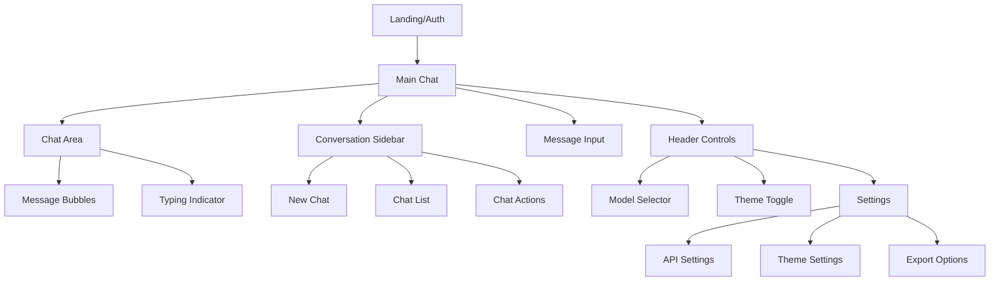
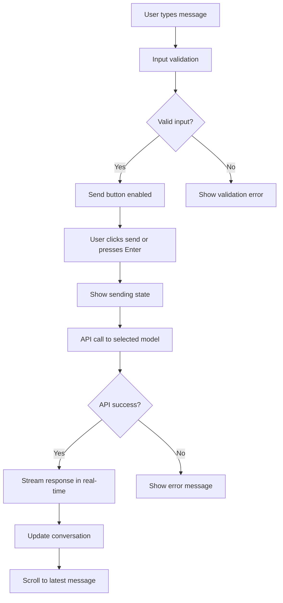
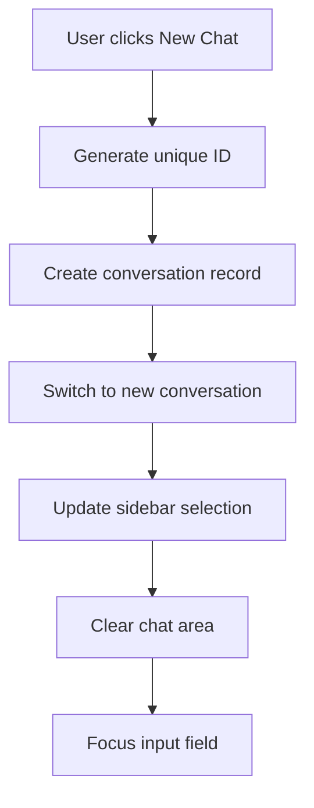
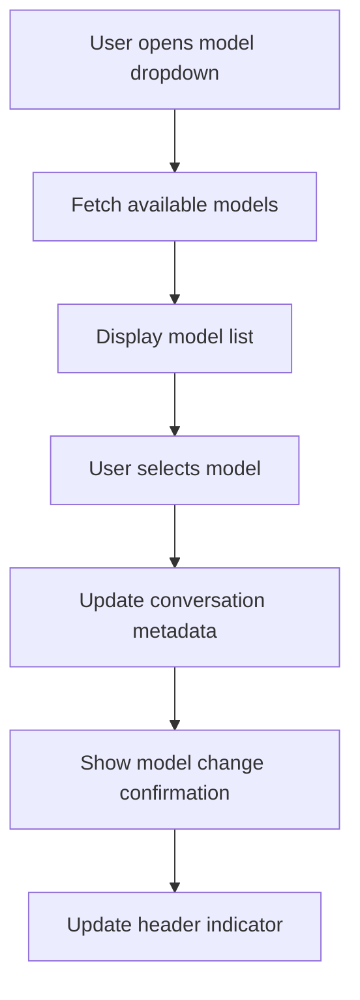

# Sleek Modern Chat Interface UI/UX Specification

## Introduction

This document defines the user experience goals, information architecture, user flows, and visual design specifications for Sleek Modern Chat Interface's user interface. It serves as the foundation for visual design and frontend development, ensuring a cohesive and user-centered experience.

### Overall UX Goals & Principles

#### Target User Personas
- **AI Developer:** Technical professionals who need efficient AI interactions for coding, debugging, and research
- **Power User:** Frequent AI users who require fast, reliable chat with advanced features
- **Casual User:** Occasional users who prioritize simplicity and clear guidance

#### Usability Goals
- **Efficiency:** Power users can complete frequent tasks with minimal clicks and <200ms response times
- **Learnability:** New users can start chatting within 30 seconds of opening the app
- **Error Prevention:** Clear validation and confirmation for all user actions
- **Accessibility:** WCAG AA compliance for all users
- **Performance:** <2s initial load time with smooth 60fps animations

#### Design Principles
1. **Minimalism First** - Clean, uncluttered interface that focuses on conversation
2. **Progressive Disclosure** - Advanced features accessible but not overwhelming
3. **Immediate Feedback** - Every action has clear, instant visual response
4. **Consistent Patterns** - Familiar chat interface conventions maintained
5. **Performance-Driven** - Design decisions optimized for speed and responsiveness

#### Change Log

| Date | Version | Description | Author |
|------|---------|-------------|--------|
| 2025-09-05 | 1.0 | Initial UI/UX specification based on PRD | UX Expert Agent |

## Information Architecture (IA)

### Site Map / Screen Inventory

### Navigation Structure

**Primary Navigation:** Model selector dropdown in header for quick AI model switching

**Secondary Navigation:** Conversation sidebar with collapsible chat list and action buttons

**Breadcrumb Strategy:** Simple conversation title display with edit capability

## User Flows

### Send Message Flow

**User Goal:** Send a message to AI and receive response

**Entry Points:** Main chat input field, keyboard shortcut (Enter)

**Success Criteria:** Message sent, streaming response received, conversation updated

#### Flow Diagram

#### Edge Cases & Error Handling
- Network disconnection during streaming
- API rate limit exceeded
- Invalid API key
- Model temporarily unavailable
- Message too long

**Notes:** Implement optimistic UI updates for immediate feedback

### Create New Conversation Flow

**User Goal:** Start a new chat conversation

**Entry Points:** New Chat button in sidebar, keyboard shortcut

**Success Criteria:** New conversation created, switched to active

#### Flow Diagram

#### Edge Cases & Error Handling
- Database connection failure
- Duplicate conversation creation
- User session expired

### Switch AI Model Flow

**User Goal:** Change the AI model for current conversation

**Entry Points:** Model selector dropdown in header

**Success Criteria:** Model changed, indicator updated

#### Flow Diagram

## Wireframes & Mockups

### Design Files
**Primary Design Files:** Figma project with interactive prototypes

### Key Screen Layouts

#### Main Chat Interface
**Purpose:** Primary screen for AI conversations

**Key Elements:**
- Header with model selector and theme toggle
- Collapsible sidebar with conversation list
- Main chat area with message bubbles
- Input area with send button and file upload

**Interaction Notes:** Responsive layout that adapts to screen size

**Design File Reference:** Main Chat Frame v1.0

#### Conversation Sidebar
**Purpose:** Manage chat conversations

**Key Elements:**
- New Chat button
- Conversation list with titles and timestamps
- Action menu for each conversation (rename, delete)

**Interaction Notes:** Collapsible on mobile, searchable list

#### Settings Panel
**Purpose:** Configure application preferences

**Key Elements:**
- API key input (secure)
- Theme selection
- Export options
- Accessibility settings

**Interaction Notes:** Modal overlay with save/cancel actions

## Component Library / Design System

### Design System Approach
Custom design system built on Tailwind CSS with consistent component library

### Core Components

#### Message Bubble
**Purpose:** Display user and AI messages

**Variants:** User message, AI message, system message

**States:** Normal, editing, error

**Usage Guidelines:** Differentiated by color/shape, support for markdown rendering

#### Input Field
**Purpose:** Text input for messages

**Variants:** Single line, multi-line with auto-resize

**States:** Normal, focused, disabled, error

**Usage Guidelines:** Auto-focus on new conversations, support for file attachments

#### Button
**Purpose:** Primary and secondary actions

**Variants:** Primary, secondary, ghost, danger

**States:** Normal, hover, active, disabled, loading

**Usage Guidelines:** Consistent sizing and spacing, keyboard accessible

#### Dropdown
**Purpose:** Model selection and menu options

**Variants:** Single select, multi-select

**States:** Open, closed, loading

**Usage Guidelines:** Keyboard navigation, search capability

## Branding & Style Guide

### Visual Identity
Modern, clean aesthetic with focus on readability and performance

### Color Palette

| Color Type | Hex Code | Usage |
|------------|----------|-------|
| Primary | #3B82F6 | Primary actions, links, focus states |
| Secondary | #6B7280 | Secondary buttons, muted text |
| Accent | #10B981 | Success states, positive feedback |
| Success | #10B981 | Confirmations, success messages |
| Warning | #F59E0B | Warnings, important notices |
| Error | #EF4444 | Errors, destructive actions |
| Neutral | #F9FAFB, #E5E7EB, #9CA3AF | Backgrounds, borders, text |

### Typography

#### Font Families
- **Primary:** Inter (sans-serif)
- **Secondary:** Inter (sans-serif)
- **Monospace:** JetBrains Mono

#### Type Scale

| Element | Size | Weight | Line Height |
|---------|------|--------|-------------|
| H1 | 2rem | 700 | 1.2 |
| H2 | 1.5rem | 600 | 1.3 |
| H3 | 1.25rem | 600 | 1.4 |
| Body | 1rem | 400 | 1.6 |
| Small | 0.875rem | 400 | 1.5 |

### Iconography
**Icon Library:** Heroicons

**Usage Guidelines:** Consistent sizing (16px, 20px, 24px), semantic color usage

### Spacing & Layout
**Grid System:** 4px base unit with 8px, 16px, 24px, 32px scale

**Spacing Scale:** Consistent padding and margins using Tailwind spacing scale

## Accessibility Requirements

### Compliance Target
**Standard:** WCAG 2.1 AA

### Key Requirements

**Visual:**
- Color contrast ratios: 4.5:1 for normal text, 3:1 for large text
- Focus indicators: 2px solid outline with primary color
- Text sizing: Minimum 14px for body text, scalable with browser settings

**Interaction:**
- Keyboard navigation: Full tab order, Enter/Space activation
- Screen reader support: Proper ARIA labels and semantic HTML
- Touch targets: Minimum 44px for mobile interactions

**Content:**
- Alternative text: Descriptive alt text for all images
- Heading structure: Logical H1-H6 hierarchy
- Form labels: Explicit labels for all form controls

### Testing Strategy
Automated accessibility testing with axe-core, manual testing with screen readers, user testing with assistive technologies

## Responsiveness Strategy

### Breakpoints

| Breakpoint | Min Width | Max Width | Target Devices |
|------------|-----------|-----------|----------------|
| Mobile | 0px | 767px | Phones in portrait/landscape |
| Tablet | 768px | 1023px | Tablets, small laptops |
| Desktop | 1024px | 1439px | Laptops, desktops |
| Wide | 1440px | - | Large displays |

### Adaptation Patterns

**Layout Changes:** Sidebar collapses to overlay on mobile, chat area stacks vertically

**Navigation Changes:** Header controls move to bottom sheet on mobile

**Content Priority:** Conversation list hidden by default on mobile, accessible via menu

**Interaction Changes:** Touch-friendly button sizes, swipe gestures for navigation

## Animation & Micro-interactions

### Motion Principles
- Subtle and purposeful animations
- Performance-optimized with transform and opacity
- Respect user motion preferences
- Consistent timing and easing

### Key Animations
- **Message Appearance:** Fade in with slide up (Duration: 300ms, Easing: ease-out)
- **Sidebar Toggle:** Slide in/out (Duration: 200ms, Easing: ease-in-out)
- **Theme Transition:** Smooth color interpolation (Duration: 400ms, Easing: ease-in-out)
- **Loading States:** Pulse animation (Duration: 1.5s, Easing: ease-in-out)
- **Hover Effects:** Scale transform (Duration: 150ms, Easing: ease-out)

## Performance Considerations

### Performance Goals
- **Page Load:** <2 seconds initial load
- **Interaction Response:** <100ms for UI interactions
- **Animation FPS:** 60fps smooth animations

### Design Strategies
- Lazy loading for conversation history
- Virtual scrolling for long conversations
- Optimized image loading with modern formats
- Minimal re-renders with React optimization
- Service worker for offline capabilities

## Next Steps

### Immediate Actions
1. Review specification with development team
2. Create detailed wireframes in Figma
3. Develop interactive prototype
4. Conduct user testing sessions
5. Refine based on feedback

### Design Handoff Checklist
- [x] All user flows documented
- [x] Component inventory complete
- [x] Accessibility requirements defined
- [x] Responsive strategy clear
- [x] Brand guidelines incorporated
- [x] Performance goals established

## Checklist Results

### UX Expert Checklist Execution Results

**Completeness Check:**
- ✅ All major user flows documented
- ✅ Component specifications complete
- ✅ Accessibility requirements defined
- ✅ Responsive design strategy clear

**Consistency Check:**
- ✅ Design principles applied consistently
- ✅ Component library coherent
- ✅ Branding guidelines followed

**Usability Check:**
- ✅ User goals clearly defined
- ✅ Error states handled
- ✅ Progressive disclosure implemented

**Technical Feasibility:**
- ✅ Performance goals achievable
- ✅ Responsive breakpoints practical
- ✅ Animation specifications implementable